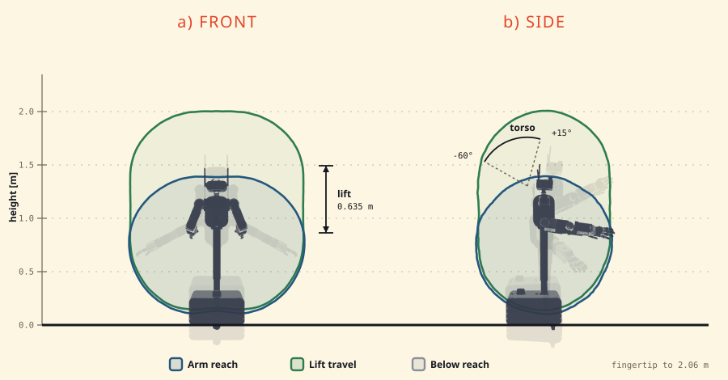

# The MABEL site's style, in one page

NYC art deco × golden-age comic book. Friendly and fun, and still a research
platform's front door. Everything below is enforced by tokens in
`assets/mabel.css` — if you find yourself typing a hex value into a rule, that
is the bug.

## Colour: three voices, and only three

| Token | Value | What it is | Where it goes |
|---|---|---|---|
| `--hi` | `#E4442A` | **The highlight.** A warm comic red. | Primary buttons, live links, accent words, the drop cap that opens a lede |
| `--hi-deep` | `#B92E17` | Its hover and its shadow | `:hover` on anything `--hi` |
| `--pop` | `#FFCE0A` | **The shout.** Saturated cab yellow. | **At most one per screen** — the BUILD ONE NOW! star, the rail title. If two things shout, neither does |
| `--rust` | `#C6301A` | **The deep voice.** | Bursts, seals, error states, defect flags |

Support, never the lead:

| Token | Value | Job |
|---|---|---|
| `--yellow` | `#F2C94C` | Narration — step cards, panel notes, captions |
| `--blue` | `#23577E` | Labels: process, "simulation", caption chips |
| `--green` | `#2E7D4F` | "It worked": clean scores, live state, ON |
| `--gold` | `#D9A13F` | Deco brass, and the accent on **dark** sections |
| `--ink` `--ink-soft` `--ash` `--ash-light` | | Gotham night: every border, every rule, every body word |
| `--bone` `--paper` `--panel` | | Aged newsprint. `--panel` is the white of a comic panel |

`--orange` and `--nyc` remain as aliases of `--hi` and `--pop` so old rules keep
working. **New code says `--hi` and `--pop`.**

## Buttons: one recipe, three roles

Every button on the site is a flat rectangle with a 2–3 px ink border, a
6–9 px radius, and a hard offset shadow — never a gradient, never a blur.

```css
.btn-primary   background: var(--hi);    color: #FFF9F0;   /* the ask */
.btn-ghost     background: var(--bone);  color: var(--ink); /* the alternative */
.nav-build     background: var(--pop);   color: var(--ink); /* the shout */
```

Hover does two things and no more: deepen the colour one step
(`--hi` → `--hi-deep`), and grow the shadow while the button moves up-left by
the same amount. That is the whole interaction language.

On a `.dark-sec` the primary flips to `--pop` on ink, because a red button on a
near-black panel disappears.

Widget buttons — `.cl-btn`, `.hs-more`, `.wt-btn`, `.hs-arrow`, `.tl-reset` —
**inherit these tokens**. They do not name their own colours. That is what
makes "keep the buttons consistent" one edit rather than thirty.

## Type

| Face | Token | Job |
|---|---|---|
| Limelight | `--font-display` | Section titles. Deco, tall, sparing |
| Bangers | `--font-comic` | Buttons, badges, kickers, sound effects |
| Jost | `--font-head` / `--font-sans` | Everything you actually read |
| Space Mono | `--font-mono` | Numbers, code, units, data labels |

A measurement is always in `--font-mono`, always with its unit. Never
`0.8` where `0.80 m/s` will do.

## Surfaces

A panel is: `--panel` fill, 3 px `--ink` border, 8–14 px radius, and a
`6px 6px 0` ink shadow. On a dark section the shadow becomes
`rgba(0,0,0,.8)` and the border becomes `--gold`.

No glass, no blur, no soft drop shadows. The whole surface language is
"flat ink on paper, printed slightly out of register".

## Motion

Hover is 0.14–0.18 s. Reveals use `.fade-up`. Anything that overshoots uses
`--spring`. Respect `prefers-reduced-motion` on anything that loops.

## Figures

Generated, never drawn by hand, and never a screenshot of a PDF:

* robot portraits → `render_module_shots.py` (from the MJCF)
* scene clips → `render_scene_grid.py`
* occupancy maps → `render_slam_maps.py`
* curation episodes → `render_curation_clips.py`
* the tip-over table → `exp_tipover_web.py`
* the labelled callout → `render_callout.py` (leader lines PROJECTED, not placed)
* the reach envelope → `render_reach_plot.py`
* the accuracy panels → `build_accuracy.py` + `render_accuracy_clips.py`
* the retargeting tiles → `retargeting_ablation/render_compare.py`
* the exploded CAD → `build_exploded.py` (the paper's drawing, background cut)

Each writes into `assets/` and each is re-runnable. A figure that cannot be
regenerated is a figure that will go stale silently.

**Set figures in the site's own type.** An SVG referenced from an ``
renders in a restricted mode that cannot fetch a webfont, so `Bangers` falls
through to the generic `cursive` — a serif, in a page set in a comic face.
Inline it instead:

```html
<div class="env-svg" data-inline-src="assets/reach-envelope.svg"
     role="img" aria-label="…"></div>
<noscript></noscript>
```

A `<div>`, not an `` — the browser starts fetching an `img`
before the script runs, and the figure comes down twice.

## Claims

Every number on the site comes from a file in the repo, and the page says
which. If it is an estimate, the page calls it an estimate. If a part is not
released yet, the page says so rather than promising it.

## Before you push

```bash
python3 -m http.server 8741      # from website/
./scripts/run_all.sh             # every check, all must pass
python3 scripts/bump_assets.py   # cache-bust the ?v= stamps
python3 scripts/loadtest.py      # what a cold visitor downloads, per page
```

## Weight

Nothing heavy loads at parse time, and that is a rule rather than a
preference — the front page was once 8.6 MB with first paint at 42 seconds.

* a `<video>` gets `preload="none"`, a `poster`, and `data-lazyvid` /
  `data-lo`. The IntersectionObserver in `mabel.js` starts it 400 px early and
  upgrades it to full quality on an idle frame after `load`. Never call
  `start()` yourself.
* a three.js viewer loads through `assets/defer-module.js`, keyed to the
  element it draws into.
* an image is saved at the size it is displayed. The marquee posters were
  900 px files in a 393 px card.

Budget: **700 kB gzipped** and 90 requests per page, checked by
`scripts/loadtest.py`. index.html has a documented exception for the hero rig,
which arrives after the load event.
